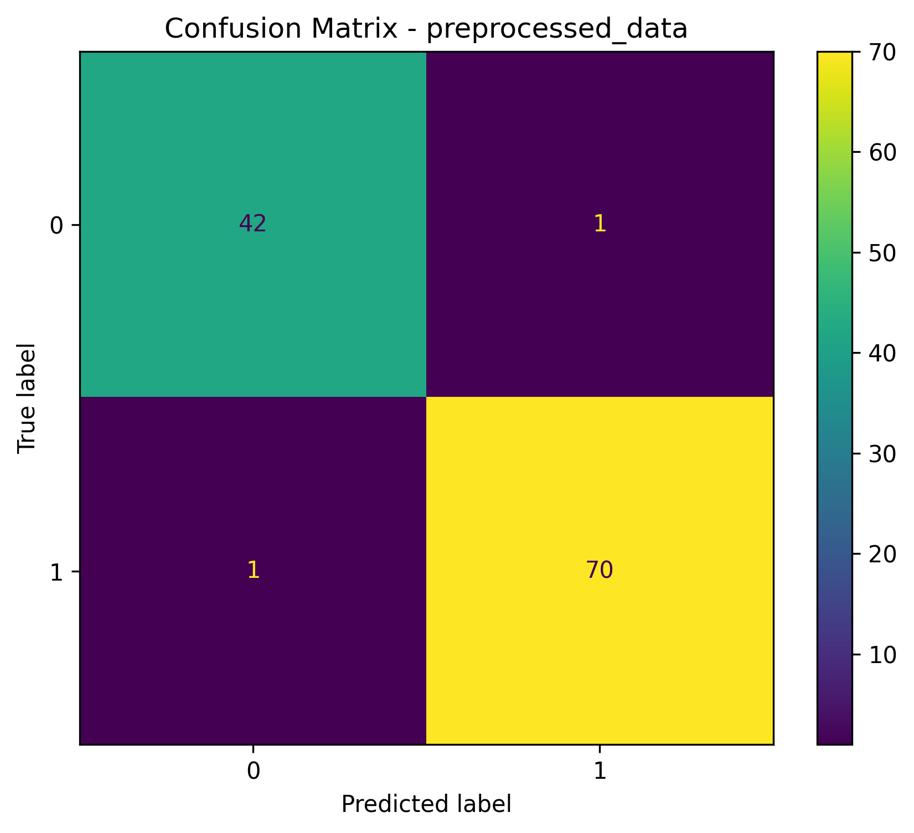
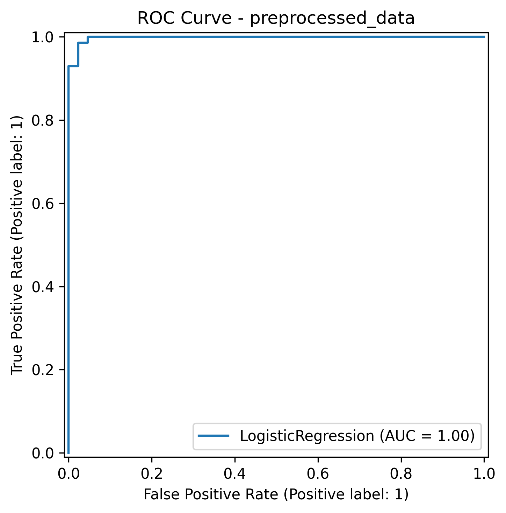
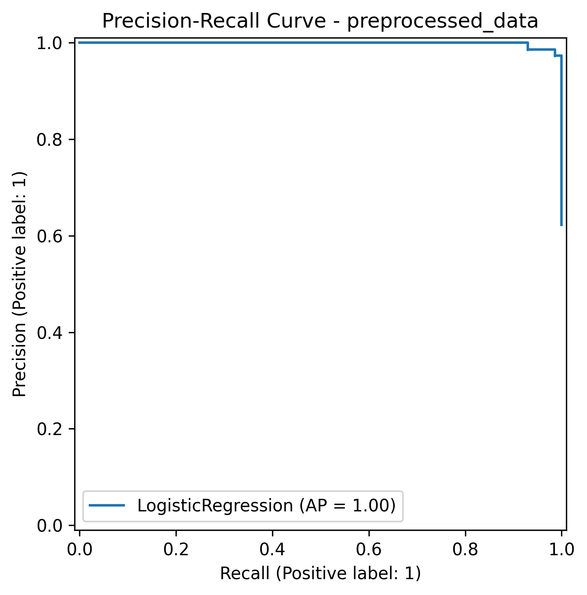
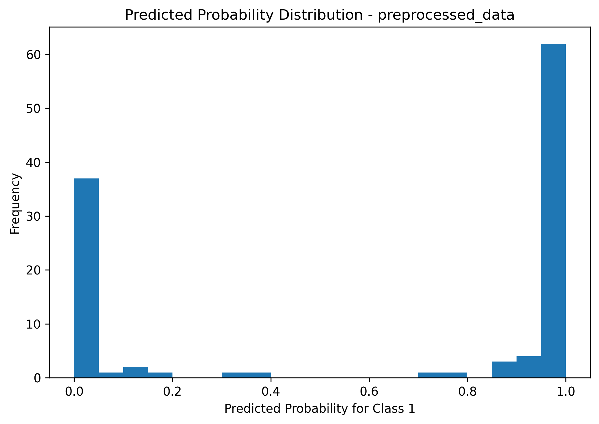
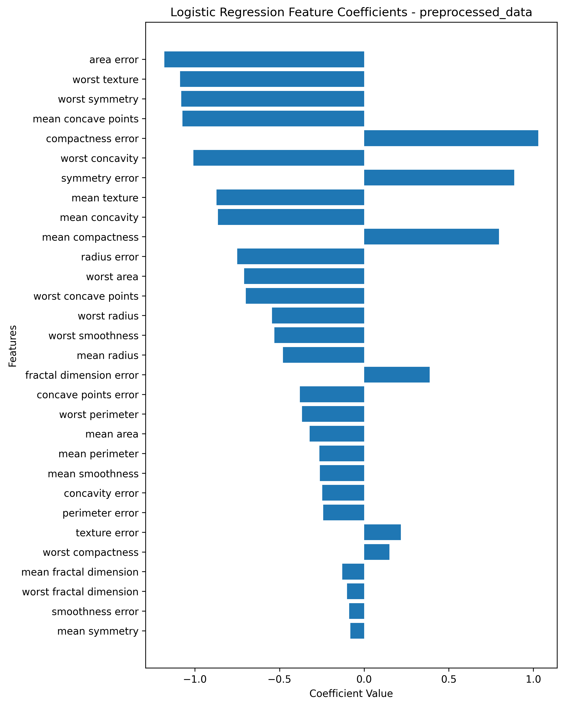
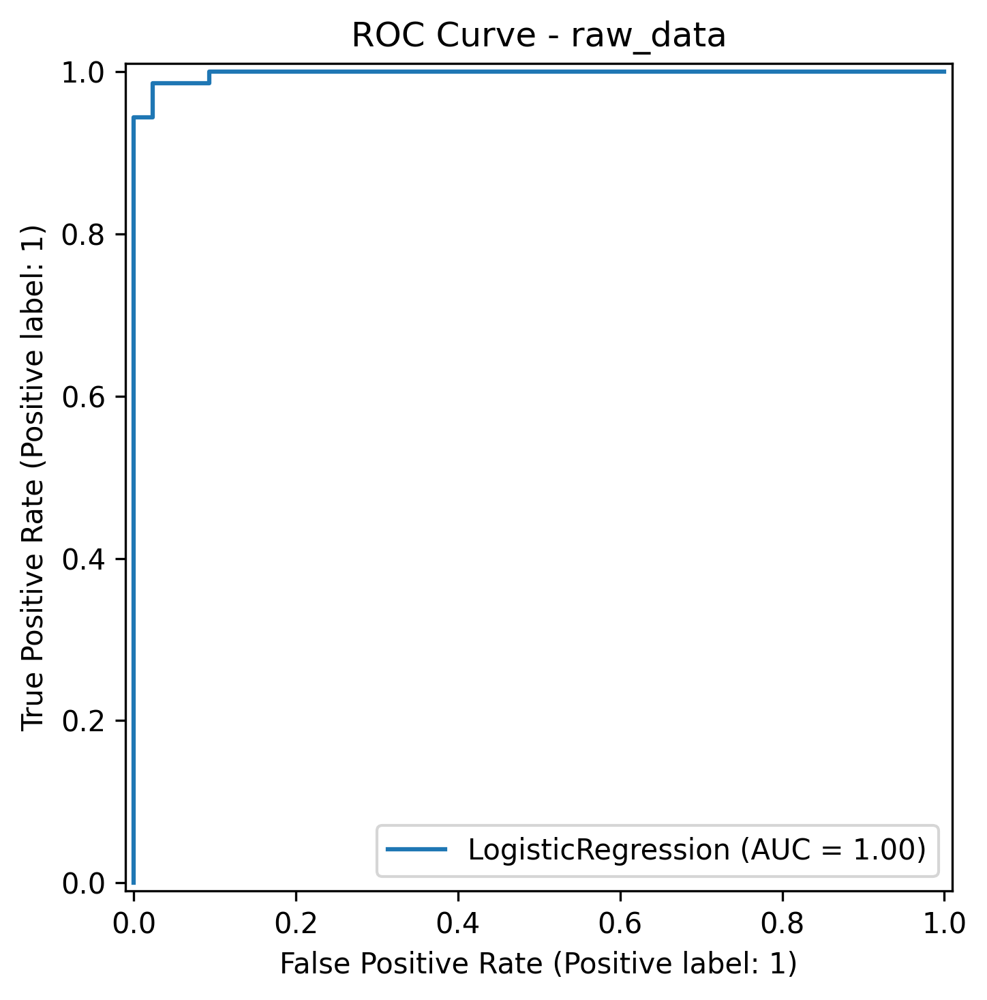
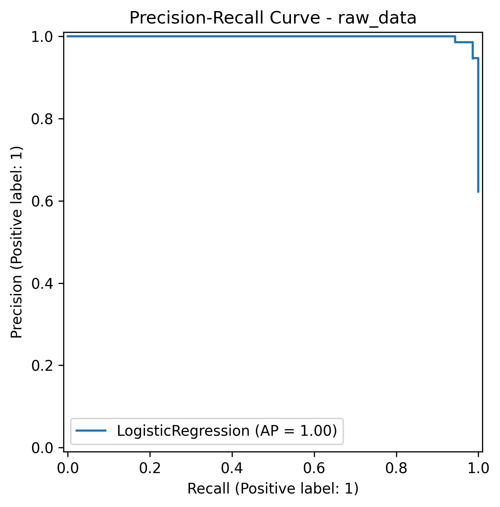
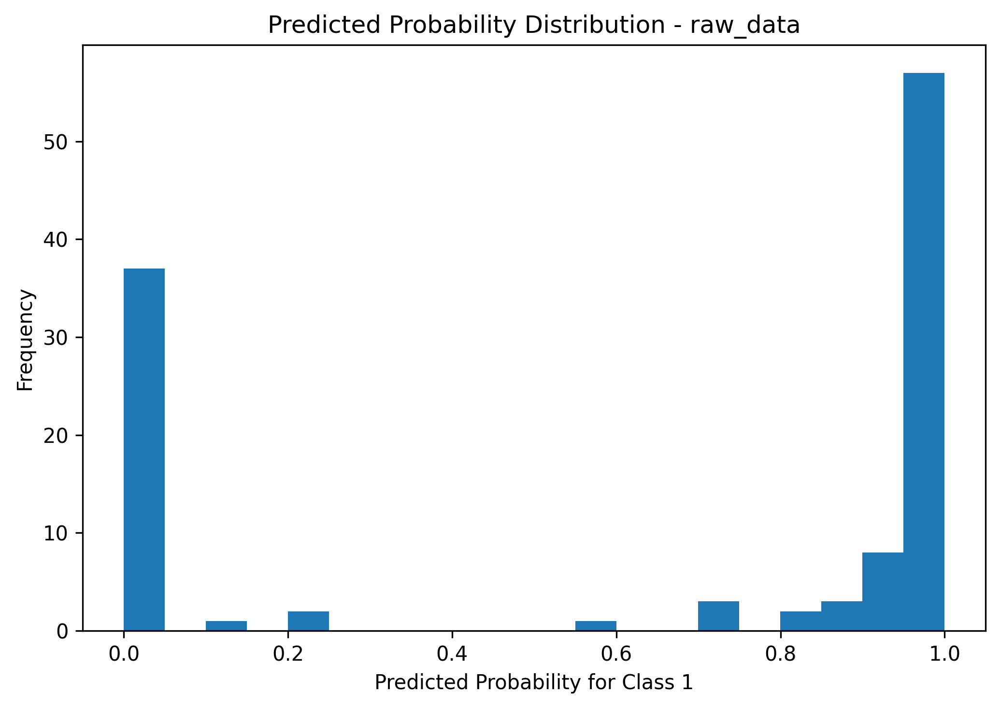
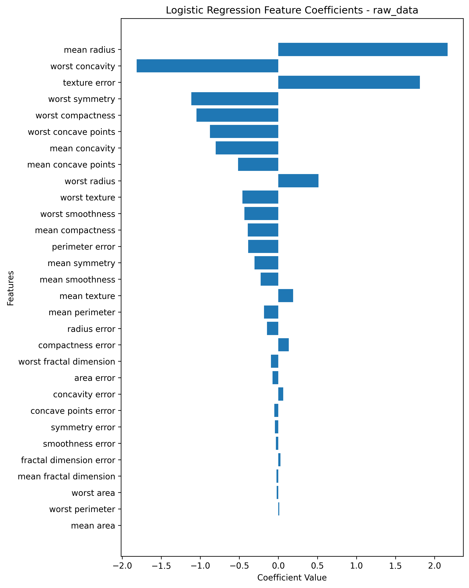

# 🔬 Breast Cancer Classification

> A classical machine learning pipeline for binary tumor classification using the Breast Cancer Wisconsin Diagnostic Dataset — comparing Logistic Regression on raw vs. preprocessed data.


---

## 📌 Table of Contents

- [Project Overview](#project-overview)
- [Dataset](#dataset)
- [Features](#features)
- [Project Structure](#project-structure)
- [Machine Learning Workflow](#machine-learning-workflow)
- [Preprocessing](#preprocessing)
- [Models](#models)
- [Results](#results)
- [Evaluation Graphs — Preprocessed Model](#evaluation-graphs--preprocessed-model)
- [Evaluation Graphs — Raw Data Model](#evaluation-graphs--raw-data-model)
- [Interpretation of Results](#interpretation-of-results)
- [Limitations](#limitations)
- [Future Work](#future-work)
- [Installation & How to Run](#installation--how-to-run)
- [Source Code Overview](#source-code-overview)
- [Key Takeaways](#key-takeaways)

---

## Project Overview

This project builds and evaluates a **binary classification model** for breast cancer diagnosis using **Logistic Regression**.

Two model versions are trained and compared side by side:

| Model Version | Description |
|---|---|
| **Raw Data** | Trained directly on original, unscaled features — used as a baseline |
| **Preprocessed Data** | Trained after `StandardScaler` + Yeo-Johnson `PowerTransformer` — the preferred final model |

The comparison demonstrates a core machine learning principle: **predictive performance alone is not sufficient to select a model**. Even when both models achieve strong accuracy, preprocessing improves optimization stability, corrects feature-scale imbalance, and produces more interpretable Logistic Regression coefficients.

**Final result:** The preprocessed model achieves **98.25% accuracy** vs. **95.61%** for the raw-data baseline — a meaningful improvement driven entirely by proper feature engineering.

---

## Dataset

**Source:** `sklearn.datasets.load_breast_cancer()`

The Breast Cancer Wisconsin Diagnostic Dataset contains numerical measurements computed from digitized fine needle aspirate (FNA) images of breast masses. Each sample corresponds to one patient biopsy result.

| Property | Value |
|---|---|
| Dataset Name | Breast Cancer Wisconsin Diagnostic |
| Problem Type | Binary Classification |
| Number of Samples | 569 |
| Number of Features | 30 |
| Missing Values | None |
| Target Classes | Malignant (0) and Benign (1) |
| Class Distribution | 212 Malignant (37.3%) / 357 Benign (62.7%) |

### Target Variable

```
0 = Malignant  →  cancerous tumor
1 = Benign     →  non-cancerous tumor
```

> ⚠️ **Medical Context:** In clinical diagnosis, a **False Negative** — predicting a malignant tumor as benign — is far more dangerous than a False Positive. A missed cancer case could delay treatment with life-threatening consequences. This project's evaluation pays close attention to **Recall for the malignant class (class 0)**.

---

## Features

The dataset includes **30 numerical features** derived from cell nucleus measurements. These cover three statistical summaries across 10 nucleus properties:

| Summary Type | Description |
|---|---|
| `mean_*` | Average value across nuclei in the sample |
| `se_*` | Standard error — variability of each measurement |
| `worst_*` | Largest (most extreme) value in the sample |

The 10 nucleus properties measured are:

| Property | What It Captures |
|---|---|
| Radius | Mean distance from center to perimeter points |
| Texture | Standard deviation of gray-scale values |
| Perimeter | Boundary length of the nucleus |
| Area | Total size of the nucleus |
| Smoothness | Local variation in radius lengths |
| Compactness | `perimeter² / area − 1.0` |
| Concavity | Severity of concave portions of the contour |
| Concave Points | Number of concave portions on the contour |
| Symmetry | Symmetry of the nucleus shape |
| Fractal Dimension | Coastline approximation — complexity of border |

Together these 30 features describe the morphological characteristics of tumor cell nuclei and form the basis for all classification decisions.

---

## Project Structure

```
breast-cancer-classification/
│
├── README.md                          ← Project documentation (this file)
├── requirements.txt                   ← Python dependencies
├── .gitignore                         ← Ignored files (pycache, venv, etc.)
│
├── notebooks/
│   └── breast_cancer_analysis.ipynb   ← Final analysis notebook (single canonical copy)
│
├── src/
│   ├── data_preprocessing.py          ← Data loading, scaling, skewness transformation
│   ├── train_model.py                 ← Model training and saving
│   └── evaluate_model.py              ← Metrics, plots, and evaluation reports
│
├── models/
│   ├── logistic_regression_model_preprocessed_data.joblib
│   └── logistic_regression_model_raw_data.joblib
│
├── results/
│   ├── logistic_regression_preprocessed_data/
│   │   ├── results_preprocessed_data.txt
│   │   ├── confusion_matrix_preprocessed_data.png
│   │   ├── roc_curve_preprocessed_data.png
│   │   ├── precision_recall_curve_preprocessed_data.png
│   │   ├── probability_distribution_preprocessed_data.png
│   │   └── feature_coefficients_preprocessed_data.png
│   │
│   └── logistic_regression_raw_data/
│       ├── results_raw_data.txt
│       ├── confusion_matrix_raw_data.png
│       ├── roc_curve_raw_data.png
│       ├── precision_recall_curve_raw_data.png
│       ├── probability_distribution_raw_data.png
│       └── feature_coefficients_raw_data.png
│
└── images/                            ← Additional visual assets for README
```

> **Note:** The root-level `Breast_cancer.ipynb` has been removed. The single canonical notebook now lives in `notebooks/`.

---

## Machine Learning Workflow

```
Load Dataset  (569 samples, 30 features, 2 classes)
        │
        ▼
Explore & Validate Data
(shape, dtypes, class balance, missing values check)
        │
        ▼
Stratified Train / Test Split  (80% train / 20% test)
        │
        ├─────────────────────────────┐
        ▼                             ▼
  RAW DATA PIPELINE         PREPROCESSED PIPELINE
        │                             │
        │                    StandardScaler
        │                    (mean=0, std=1)
        │                             │
        │                    Skewness Detection
        │                    (|skew| > 1.0 threshold)
        │                             │
        │                    PowerTransformer
        │                    (Yeo-Johnson method)
        │                             │
        ▼                             ▼
Logistic Regression          Logistic Regression
  (on raw features)           (on clean features)
        │                             │
        └──────────────┬──────────────┘
                       ▼
            Evaluate & Compare Both Models
     Accuracy | Precision | Recall | F1 | ROC-AUC
                       │
                       ▼
          Save Models (.joblib) + All Visualizations
```

---

## Preprocessing

### Why Preprocessing Matters for Logistic Regression

Logistic Regression is a linear model optimized using gradient-based methods. When features have vastly different numerical ranges — for example, `area` values in the hundreds while `fractal_dimension` values hover near zero — the gradient optimizer must navigate a poorly-scaled loss landscape. This causes slower convergence and distorts learned coefficients, making them incomparable across features.

### Step 1 — Standard Scaling

All 30 features are standardized using `StandardScaler`:

```python
from sklearn.preprocessing import StandardScaler

scaler = StandardScaler()
X_train_scaled = scaler.fit_transform(X_train)   # fit + transform on training set
X_test_scaled  = scaler.transform(X_test)         # transform only on test set
```

After scaling, every feature has approximately:
```
mean  ≈ 0
std   ≈ 1
```

> ⚠️ **Data Leakage Prevention:** The scaler is **fitted exclusively on training data** and then applied to the test set. Fitting on the full dataset before splitting would leak test-set statistics into training — a common but serious mistake that inflates reported performance.

### Step 2 — Skewness Detection and Yeo-Johnson Transformation

Highly skewed features are identified using the training set. Any column with an absolute skewness score greater than `1.0` is transformed using the Yeo-Johnson method:

```python
from sklearn.preprocessing import PowerTransformer

# Identify skewed features using training data only
skewed_cols = [col for col in X_train_df.columns
               if abs(X_train_df[col].skew()) > 1.0]

# Apply Yeo-Johnson transformation
pt = PowerTransformer(method="yeo-johnson")
X_train_df[skewed_cols] = pt.fit_transform(X_train_df[skewed_cols])
X_test_df[skewed_cols]  = pt.transform(X_test_df[skewed_cols])
```

**Why Yeo-Johnson over Box-Cox?**

| Method | Handles Negative Values | Handles Zero | Use Case |
|---|---|---|---|
| Box-Cox | ❌ No | ❌ No | Only strictly positive data |
| Yeo-Johnson | ✅ Yes | ✅ Yes | General purpose — preferred here |

The Yeo-Johnson transformation shifts skewed distributions toward a more Gaussian shape, reduces the influence of extreme outliers, and helps Logistic Regression assign more meaningful coefficients.

---

## Models

### Raw-Data Model

```
models/logistic_regression_model_raw_data.joblib
```

Trained directly on the original, unscaled feature values. Included as a **controlled baseline** to show what happens when feature engineering is skipped. The raw model still achieves reasonable accuracy because the Wisconsin dataset is relatively linearly separable — but it produces unreliable coefficient magnitudes. As visible in the coefficient plot, `mean radius` dominates at ~2.15 simply because its numerical scale is large, not because it is biologically more important.

### Preprocessed-Data Model

```
models/logistic_regression_model_preprocessed_data.joblib
```

Trained after standardization and Yeo-Johnson transformation. This is the **preferred final model** because:

- All features are on a comparable scale before training
- Skewed distributions are corrected, reducing outlier influence
- The gradient optimizer converges more cleanly
- Coefficient magnitudes are directly comparable across all 30 features
- The workflow follows established machine learning best practice

---

## Results

Both models were evaluated on the held-out test set: **114 samples** from a stratified 80/20 split of 569 total samples.

### Model Performance Summary

| Metric | Raw Data Model | Preprocessed Model | Change |
|---|---|---|---|
| **Accuracy** | 95.61% | **98.25%** | +2.64 pp |
| **Precision — Malignant (0)** | 0.97 | **0.98** | +0.01 |
| **Recall — Malignant (0)** | 0.91 | **0.98** | **+0.07 ⬆️** |
| **F1-Score — Malignant (0)** | 0.94 | **0.98** | +0.04 |
| **Precision — Benign (1)** | 0.95 | **0.99** | +0.04 |
| **Recall — Benign (1)** | 0.99 | 0.99 | — |
| **F1-Score — Benign (1)** | 0.97 | **0.99** | +0.02 |
| **ROC-AUC** | 1.00 | 1.00 | — |
| **Average Precision** | 1.00 | 1.00 | — |

> 🏆 The most clinically significant improvement is **Recall for malignant tumors: 0.91 → 0.98**. The raw model missed 4 malignant cases out of 43. The preprocessed model missed only 1. Preprocessing reduced the most dangerous error type by **75%**.

---

### Detailed Classification Report — Preprocessed Model

```
Accuracy: 98.25%

              precision    recall  f1-score   support

           0       0.98      0.98      0.98        43    ← Malignant
           1       0.99      0.99      0.99        71    ← Benign

    accuracy                           0.98       114
   macro avg       0.98      0.98      0.98       114
weighted avg       0.98      0.98      0.98       114
```

### Detailed Classification Report — Raw Data Model

```
Accuracy: 95.61%

              precision    recall  f1-score   support

           0       0.97      0.91      0.94        43    ← Malignant
           1       0.95      0.99      0.97        71    ← Benign

    accuracy                           0.96       114
   macro avg       0.96      0.95      0.95       114
weighted avg       0.96      0.96      0.96       114
```

### Confusion Matrix Breakdown

**Preprocessed Model:**

| | Predicted Malignant (0) | Predicted Benign (1) |
|---|---|---|
| **Actual Malignant (0)** | ✅ 42 correctly identified | ❌ 1 missed (false negative) |
| **Actual Benign (1)** | ❌ 1 false alarm (false positive) | ✅ 70 correctly identified |

**Raw Data Model:**

| | Predicted Malignant (0) | Predicted Benign (1) |
|---|---|---|
| **Actual Malignant (0)** | ✅ 39 correctly identified | ❌ 4 missed (false negatives) |
| **Actual Benign (1)** | ❌ 1 false alarm (false positive) | ✅ 70 correctly identified |

> The raw model produced **4 false negatives** — malignant tumors sent home as healthy. The preprocessed model produced **1**. Both made the same single false positive. The entire performance gap is concentrated in cancer detection.

---

## Evaluation Graphs — Preprocessed Model

### Confusion Matrix



Near-perfect class separation. 42 of 43 malignant cases correctly caught. 70 of 71 benign cases correctly cleared. Only 2 total errors on 114 test samples.

---

### ROC Curve



The curve rises steeply to the top-left corner — the ideal shape — with **AUC = 1.00**. The model's probability scores perfectly rank all benign samples above all malignant samples on this test set. Note that the curve shows a small step near TPR = 0.93 at a near-zero false positive rate — this reflects the single false negative in the confusion matrix.

---

### Precision-Recall Curve



The curve holds near (1.0, 1.0) across almost all recall thresholds before a sharp precision drop at the far right (recall → 1.0). **Average Precision = 1.00**. The slight drop at the end corresponds to the model's few uncertain predictions near the decision boundary.

> Note: This curve uses class 1 (benign) as the positive label. For clinical reporting, the curve should be regenerated with class 0 (malignant) as positive.

---

### Predicted Probability Distribution



Predictions cluster sharply at two poles. A large peak near 0.0 (model is confident: malignant) and a large peak near 1.0 (model is confident: benign). The near-empty middle region shows that the preprocessed model makes very few uncertain predictions — a hallmark of a well-calibrated, clearly-separated classifier. Small bars scattered in the 0.1–0.9 range correspond to the handful of borderline samples that produced the 2 total errors.

---

### Feature Coefficient Plot



Because features are standardized, coefficient magnitudes are directly comparable. Key findings:

**Strongest predictors of malignancy (negative coefficients):**
- `area error` (~−1.3) — high variability in nucleus area strongly signals malignancy
- `worst texture` (~−1.2) — extreme texture irregularity at the worst site
- `worst symmetry` (~−1.1) — asymmetry in the most abnormal nucleus
- `mean concave points` (~−1.1) — greater average concavity across the sample

**Strongest predictors of benign (positive coefficients):**
- `compactness error` (~+1.0) — variability in compactness
- `symmetry error` (~+0.9) — variability in symmetry measurement
- `mean compactness` (~+0.85)

Features with coefficients near zero (e.g., `mean symmetry`, `smoothness error`) contribute negligibly to predictions and could be candidates for removal in a feature selection step.

---

## Evaluation Graphs — Raw Data Model

### Confusion Matrix


The raw model made **4 false negatives** — 4 malignant tumors classified as benign. Compared to the preprocessed model's 1 false negative, this is the clearest clinical difference between the two approaches.

---

### ROC Curve



**AUC = 1.00** — identical to the preprocessed model at this summary level. This is the clearest demonstration of why ROC-AUC alone is insufficient for model selection. Despite having 4 false negatives, the raw model's AUC looks perfect because AUC measures ranking ability across all thresholds, not the quality of predictions at the default 0.5 threshold. Always examine the confusion matrix alongside AUC.

---

### Precision-Recall Curve



**Average Precision = 1.00** — again matching the preprocessed model at this aggregate level. The 4 false negatives are hidden within this summary statistic. The slight rightward shift of the late-recall drop compared to the preprocessed curve is the only visible signal of the raw model's lower threshold performance.

---

### Predicted Probability Distribution



Compared to the preprocessed model, the raw model shows a wider, more dispersed spread in the 0.7–0.95 probability range. More samples fall in an ambiguous zone between the two poles. This reflects lower model confidence: the raw model struggled to establish sharp decision boundaries for borderline cases that the preprocessed model resolved cleanly.

---

### Feature Coefficient Plot



This plot reveals the core problem with interpreting unscaled Logistic Regression. **`mean radius`** has a coefficient of ~+2.15 and **`texture error`** has ~+1.8 — they dominate the chart. But this dominance reflects their large numerical scales, not their genuine biological importance. Meanwhile, features like `worst area` and `worst perimeter` have near-zero coefficients despite being biologically meaningful — because their raw values are absorbed into other correlated, large-scale features. This coefficient plot should **not** be used for feature importance conclusions. Compare to the preprocessed model's plot to see the difference proper scaling makes.

---

## Interpretation of Results

### What the Confusion Matrix Tells Us

The confusion matrix breaks down all 114 test predictions into four outcomes:

| Outcome | Preprocessed | Raw | Medical Meaning |
|---|---|---|---|
| True Negative (TN) — Malignant → Malignant | 42 | 39 | Correct cancer detection |
| True Positive (TP) — Benign → Benign | 70 | 70 | Correct healthy classification |
| False Positive (FP) — Benign → Malignant | 1 | 1 | Unnecessary follow-up / biopsy |
| **False Negative (FN) — Malignant → Benign** | **1** | **4** | **Missed cancer ← most dangerous** |

The False Negative is the error that matters most. Preprocessing reduced this from 4 to 1 — a 75% reduction in the worst possible outcome.

### Why ROC-AUC = 1.00 for Both Models Is Not the Full Story

Both models report ROC-AUC = 1.00. This can create a false impression of equivalence. AUC measures whether the model's probability scores correctly rank positive above negative samples across all possible thresholds — it does not measure the quality of specific threshold decisions. The raw model's AUC looks perfect despite having 4 false negatives. **Always examine the confusion matrix alongside curve-based metrics**, especially in medical classification problems.

### Reading the Feature Coefficient Plot

For Logistic Regression with the label encoding used here (`0 = malignant`, `1 = benign`):

```
Positive coefficient  →  feature pushes prediction toward class 1 (Benign)
Negative coefficient  →  feature pushes prediction toward class 0 (Malignant)
Larger |coefficient|  →  stronger influence on the final prediction
Near-zero coefficient →  negligible contribution; candidate for removal
```

Only the **preprocessed model's** coefficient plot should be used for biological interpretation, because the features have been placed on a comparable scale. The raw model's coefficient magnitudes reflect numerical scale, not feature importance.

### Reading the Probability Distribution

A well-separated model shows two sharp, narrow peaks — one near 0 for malignant and one near 1 for benign — with minimal mass in the middle. The preprocessed model achieves this cleanly. The raw model's distribution shows more spread and a larger uncertainty region between 0.7 and 0.95, indicating that the optimizer failed to fully resolve several borderline cases.

---

## Limitations

This project is a solid classical ML baseline. The following limitations are acknowledged:

1. **Single train-test split** — all reported metrics come from one 80/20 split. The exact random state influences every reported number. Cross-validation would give a statistically more robust estimate with uncertainty bounds.

2. **No hyperparameter tuning** — Logistic Regression uses the scikit-learn default `C=1.0` regularization. A grid search over `C` values and solvers might yield further gains.

3. **Only one model family** — only Logistic Regression is trained. Non-linear models (Random Forest, SVM, Gradient Boosting) might achieve higher performance or provide complementary insights.

4. **Preprocessing pipeline not saved as a single object** — the `StandardScaler` and `PowerTransformer` are saved separately from the model. At inference time, new data must be manually transformed in the correct order. A scikit-learn `Pipeline` would solve this and eliminate the risk of misapplication.

5. **Positive class is benign for curves** — the ROC and Precision-Recall curves use class 1 (benign) as the positive label. For clinical-facing evaluation, these curves should be regenerated using class 0 (malignant) as the positive class to directly measure cancer detection performance.

6. **Small dataset** — 569 samples is adequate for this research problem, but real clinical deployment would require external validation on independent, multi-site patient cohorts.

7. **No confidence intervals** — all reported metrics are point estimates from a single test set of 114 samples. There is meaningful statistical uncertainty around every number.

8. **No deployment interface** — the model exists only as a `.joblib` file with no prediction script, REST API, or user-facing application.

---

## Future Work

Planned improvements ranked by impact:

- [ ] **Cross-validation** — implement `StratifiedKFold` (k=5) to produce mean ± std performance estimates across multiple splits
- [ ] **Full Pipeline object** — wrap `StandardScaler` + `PowerTransformer` + `LogisticRegression` in a single `sklearn.pipeline.Pipeline` and save as one artifact
- [ ] **Hyperparameter tuning** — run `GridSearchCV` over `C`, `penalty`, and `solver` parameters for the Logistic Regression
- [ ] **Multi-model comparison** — train and compare: SVM (linear + RBF), Random Forest, KNN, Gradient Boosting, XGBoost
- [ ] **Malignant-class curves** — regenerate ROC and PR curves using class 0 (malignant) as the positive label
- [ ] **Prediction script** — add `src/predict.py` that accepts feature input and returns a classification with confidence score
- [ ] **Feature selection** — use the preprocessed coefficient magnitudes to identify and remove near-zero features; test whether a reduced model maintains performance
- [ ] **Streamlit app** — build an interactive web interface for model inference
- [ ] **Unit tests** — add `tests/` directory with pytest coverage for preprocessing and training logic
- [ ] **Model card** — document intended use, known failure modes, performance by subgroup, and responsible use guidelines

---

## Installation & How to Run

### 1. Clone the Repository

```bash
git clone https://github.com/AsadKhan37/breast-cancer-classification.git
cd breast-cancer-classification
```

### 2. Create a Virtual Environment (Recommended)

```bash
# Create the environment
python -m venv venv

# Activate — Linux / macOS
source venv/bin/activate

# Activate — Windows
venv\Scripts\activate
```

### 3. Install Dependencies

```bash
pip install -r requirements.txt
```

`requirements.txt`:

```
pandas>=1.3
numpy>=1.21
scikit-learn>=1.0
matplotlib>=3.4
joblib>=1.1
```

### 4. Train Both Models

```bash
python src/train_model.py
```

This will:
- Load the breast cancer dataset from scikit-learn
- Split into 80% train / 20% test (stratified by class)
- Train Logistic Regression on raw features → save to `models/logistic_regression_model_raw_data.joblib`
- Apply StandardScaler + PowerTransformer → train Logistic Regression → save to `models/logistic_regression_model_preprocessed_data.joblib`

### 5. Evaluate Both Models

```bash
python src/evaluate_model.py
```

This will:
- Load both saved model files
- Run predictions on the held-out test set
- Print full classification reports to console
- Save to `results/`:
  - `results_*.txt` — text classification report with accuracy and per-class metrics
  - `confusion_matrix_*.png`
  - `roc_curve_*.png`
  - `precision_recall_curve_*.png`
  - `probability_distribution_*.png`
  - `feature_coefficients_*.png`

### 6. Run the Notebook (Optional)

```bash
jupyter notebook notebooks/breast_cancer_analysis.ipynb
```

Walks through the full pipeline interactively with inline visualizations and cell-by-cell explanations.

---

## Source Code Overview

### `src/data_preprocessing.py`

Handles all data loading, splitting, and transformation.

| Function | Input | Output |
|---|---|---|
| `load_data()` | — | `X` (features DataFrame), `y` (labels Series) |
| `load_and_preprocess_data()` | — | Scaled/transformed train and test splits ready for modeling |

Key design decisions:
- Scaler and transformer are **fitted on training data only** — no test leakage
- Skewness detection threshold: absolute skewness > `1.0`
- Yeo-Johnson chosen over Box-Cox to support the full range of feature values

---

### `src/train_model.py`

Trains and saves both Logistic Regression model versions.

| Function | Saves To |
|---|---|
| `train_logistic_regression_model_raw_data()` | `models/logistic_regression_model_raw_data.joblib` |
| `train_logistic_regression_model_preprocessed_data()` | `models/logistic_regression_model_preprocessed_data.joblib` |

---

### `src/evaluate_model.py`

Loads both models and generates the full evaluation suite.

Output saved per model:
- Classification report text file
- Confusion matrix heatmap
- ROC curve with AUC score
- Precision-Recall curve with Average Precision score
- Predicted probability distribution histogram
- Feature coefficient bar chart (sorted by magnitude)

---

## Key Takeaways

**1. Preprocessing improved the most clinically important metric.**
Recall for the malignant class improved from **0.91 to 0.98** — the raw model missed 4 cancer cases that the preprocessed model caught. This is the difference that matters in real-world medical screening, not the 2.64 percentage point accuracy gain.

**2. ROC-AUC = 1.00 for both models — and that is exactly the problem.**
If only ROC-AUC were reported, the two models would look identical. The confusion matrix reveals the real story: 4 false negatives vs. 1. Aggregate curve metrics can hide individual threshold failures. Always inspect predictions at the actual operating threshold.

**3. Raw coefficient plots are misleading.**
In the raw model, `mean radius` dominates at ~2.15 because of its numerical scale, not because it is biologically important. After standardization, the coefficient plot reflects genuine predictive contribution. `area error` emerges as the strongest individual signal — a finding that is impossible to extract from the raw model's coefficients.

**4. Reproducible pipelines matter more than accuracy scores.**
Saving the model without the fitted scaler and transformer means every deployment must manually replicate the exact preprocessing steps. One mistake — applying the wrong transformer, or applying it to test data before splitting — silently corrupts predictions. A `Pipeline` object eliminates this entire class of errors.

---

## Conclusion

This project implements a complete, reproducible classical machine learning pipeline for breast cancer classification.

The preprocessed Logistic Regression model is the final recommended model: **98.25% accuracy**, **0.98 recall on the malignant class**, and interpretable, scale-comparable feature coefficients. The raw-data baseline was included not to compete but to illustrate precisely why preprocessing matters for linear models — and the confusion matrices make the case clearly and quantifiably.

The repository structure, full evaluation suite, documented limitations, and detailed interpretation bring this project to a strong student portfolio standard.

---

## Repository Cleanup

Before pushing, run the following to remove Python cache files from Git tracking:

```bash
# Remove cached pycache from Git tracking
git rm -r --cached src/__pycache__
git rm -r --cached __pycache__

# Stage and commit cleanup
git add .gitignore requirements.txt README.md
git commit -m "docs: update README with full metrics, embedded graphs, and interpretation"
git push origin main
```

Recommended `.gitignore`:

```gitignore
# Python
__pycache__/
*.pyc
*.pyo

# Jupyter
.ipynb_checkpoints/

# Virtual environments
.env
.venv/
venv/

# OS files
.DS_Store
Thumbs.db

# IDE
.vscode/
.idea/
```

---

*Last updated: 2025 — Asad Khan*
